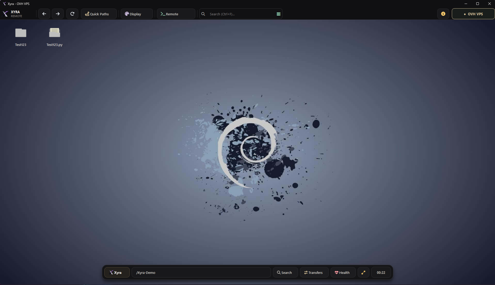
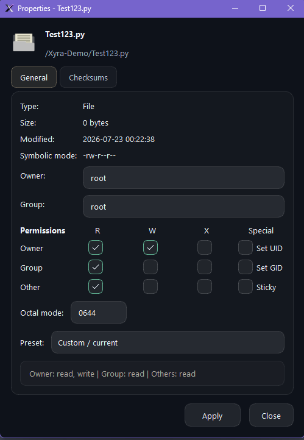

<p align="center">
  
</p>

<h1 align="center">Xyra</h1>

<p align="center">
  <strong>Your VPS, as a desktop.</strong><br>
  A native Windows workspace for managing Linux servers visually over SSH and SFTP.
</p>

<p align="center">
  
  
  
  
</p>

<p align="center">
  <a href="../../releases"><strong>Releases</strong></a>
  &middot;
  <a href="RELEASE-1.7.3.md"><strong>What's new</strong></a>
  &middot;
  <a href="SECURITY.md"><strong>Security</strong></a>
</p>

<p align="center">
  
</p>

<p align="center">
  <sub>A connected Linux workspace in Xyra - direct over SSH and SFTP.</sub>
</p>

---

## What Xyra actually is

Xyra turns a remote Linux filesystem into a focused, desktop-like workspace on Windows.
You connect to a VPS through normal SSH/SFTP credentials and then browse, edit, transfer,
organize and inspect its files without living inside terminal commands or a dated two-pane client.

It is built for people who regularly work inside webroots, application folders, game servers,
configuration trees, logs, assets, backups and self-hosted services.

> Xyra is not a web-hosting control panel, a server provisioning platform or a replacement for
> the Linux terminal. It is the visual workspace beside your terminal: the place where remote
> files feel tangible, understandable and comfortable to work with.

## Why use it?

Traditional SFTP tools are good at moving files, but they rarely feel like a place where you want
to work. Xyra combines familiar desktop interaction with remote-aware safety and server tooling:

| Work visually | Stay productive | Avoid expensive mistakes |
| --- | --- | --- |
| Browse remote folders like a desktop | Edit code and configuration in tabs | Verify unknown SSH host fingerprints |
| Drag, reorder and search items naturally | Keep independent workspaces for multiple VPS sessions | Warn before touching sensitive files |
| Preview images and inspect metadata | Queue transfers with progress, speed and ETA | Confirm conflicts, replacements and risky permissions |

## Built for real remote workflows

### Multiple servers, one window

- Open VPS connections as in-window workspaces instead of separate Xyra processes.
- Keep path, history, selection and desktop layout independent in every server tab.
- Open more than one workspace for the same VPS when two tasks need different locations.
- Disconnect cleanly and close SSH/SFTP transports automatically when Xyra exits.

### A remote desktop that behaves naturally

- Drag and drop uploads, desktop-style selection and keyboard navigation.
- Compact icon layout with live insertion gaps and persistent manual ordering.
- Smart two-line names with middle ellipsis and full-name hover details.
- Quick Paths, recent locations, back/forward navigation and remote search.
- Built-in Numix icon variants, custom icon packs and static or animated backgrounds.

### Files, code and assets

- Notepad++-inspired tabbed editor with syntax highlighting, Find/Replace and line tools.
- Preserve LF or CRLF line endings when saving files back to Linux.
- Preview remote images and open safe files externally when needed.
- Inspect ownership, UID/GID, symbolic and octal permissions, plus MD5/SHA1/SHA256.
- Work with common archives including ZIP, RAR, 7z, PK3 and IWD.

<p align="center">
  
</p>

<p align="center">
  <sub>Inspect remote metadata and edit Linux permissions without losing sight of what each mode means.</sub>
</p>

### Transfers without freezing the interface

- Upload and download in the background with progress, speed and ETA.
- Cancel active work and retry failed jobs from the Transfer Center.
- Resolve file and folder conflicts through one consistent workflow.
- Keep using the dashboard while slower remote operations finish.

### Recovery and server insight

- Restore Xyra-deleted items through the remote Trash Manager.
- View a compact server-health snapshot without leaving the workspace.
- Get readable in-app errors for inaccessible paths, broken links and failed operations.

## How it connects

```text
Windows PC running Xyra - SSH / SFTP -> Your Linux VPS
```

Xyra connects directly from your PC to the server. It does not require a browser dashboard,
Docker container, web service or Xyra agent on the VPS. If the server already accepts SSH/SFTP,
it is ready for Xyra.

Saved passwords use the operating-system keyring when available, with Windows DPAPI as a secure
fallback. Unknown host keys require fingerprint confirmation, changed keys are rejected, and
configured remote-root boundaries are enforced across file operations and symbolic links.

## Good fits

- Managing websites, webroots and deployment files
- Editing service, application and reverse-proxy configuration
- Maintaining game servers, maps, mods and asset packs
- Browsing logs, backups, exports and generated files
- Moving content between a Windows workstation and one or more VPS machines
- Anyone who uses a terminal for commands but wants a better visual workflow for files

## Quick start

```text
git clone https://github.com/mambuzrrr/Xyra-Core.git
cd Xyra-Core
python -m pip install -r requirements.txt
python Dashboard.py
```

Python 3.11 or newer is recommended. Xyra is currently focused on Windows x64 clients and Linux
SSH/SFTP targets.

## Security approach

Remote administration tools deserve conservative defaults. Xyra includes:

- SHA-256 SSH host-key verification and persistent known-host checks
- OS-backed secret storage instead of plaintext saved passwords
- Remote-root and symbolic-link escape protection
- Sensitive-file warnings and limits for editor reads, archives and command output
- Explicit conflict handling for destructive file operations

Please report suspected vulnerabilities privately using the process in [SECURITY.md](SECURITY.md).

## Project status

Xyra is an independent project in active development. Version 1.7.3 expands the original remote
desktop concept into a multi-server workspace with safer file operations, a serious editor,
and background transfers.

If Xyra makes VPS work more comfortable for you, starring the repository helps other people find it.
